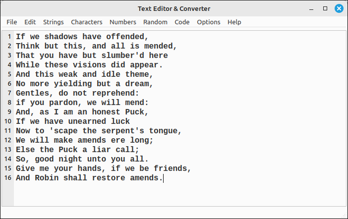

.. Text Converter documentation master file, created by
   sphinx-quickstart on Sat Jan 18 09:56:28 2025.

Text Editor & Converter User's Guide
====================================

.. toctree::
   :hidden:

   Introduction <self>
   Editingops.rst

Introduction
------------

The Text Converter is a simple text and numeric manipulation application that allows the user to do some specialized conversions that may not be available in a standard text editor or programming IDE. Many of the options in this program are designed to make text conversions easier.  It was originally designed for specific conversions in the areas of cryptography and computer graphics, but is a useful general plain text editor.

A detailed description of the functionality can be found on the editing options page. In general, there are some standard character manipulations, line splitting and joining, whitespace and special character removals, character encoding and decoding common in classical cryptography, numeric base conversions, random number and bit sequence generation, conversion of text to C++ style strings, and a few special code condensing functions common when incorporating code text strings into C++ programs, such as incorporating GLSL shader code into a graphics program.

Program Layout
--------------

The program layout is simple, an editing area takes the major portion of the window with a menu at the top for all the conversions options.

Editor Options
--------------

The options menu contains a few options for the look and feel of the editing area.

* **Toggle Bold**: Toggles the bold setting for the editor font.

* **Toggle Italic**: Toggles the italic setting for the editor font.

* **Font Size...**: Opens a dialog box for the user to set the font size, 5-72.

* **Select Font...**: Opens a dialog box for the user to select a new font family.

* **Reset Font**: Resets the font to the default font, monospaced, 12 point, bold.

* **Select Line Highlight Color...**: Opens a color dialog box for the user to select the background color for the highlighted line.

* **Reset Line Highlight Color**: Resets the background color of the highlighted line to the default setting, light blue.

* **Select Theme...**: Opens a selection dialog box for the user to select a system supported theme.  There are not may options here and, in general, the Fusion theme has the best look and feel across platforms.

.. note::

    When an option is changed the options are saved to the TextConverterOptions.opt file and read in on the next run of the program. So your next session will have the same options as the last session. If this file gets moved or deleted you will need to reset the options you want.

